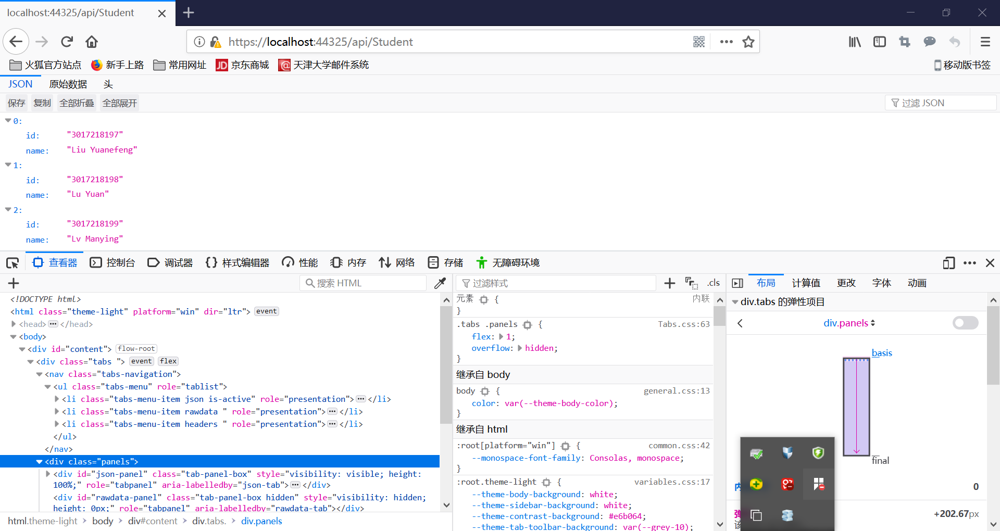
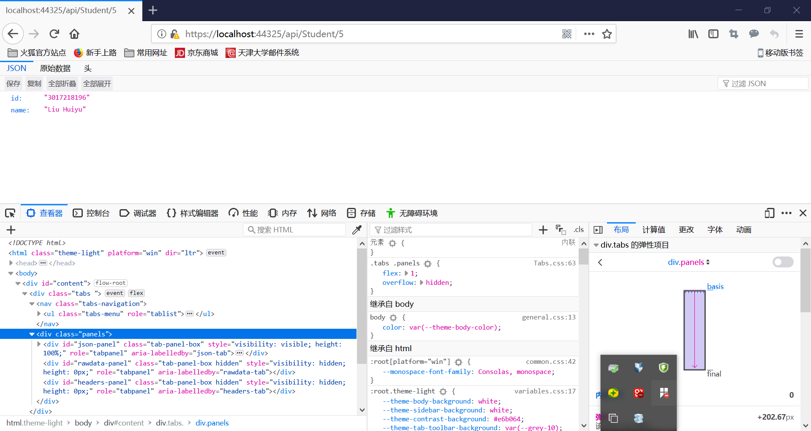

# homework04
C# homework4, by Lu Yuan, in May 7th, 2019

## Introduction
1. This is a Web API based on the model of ASP.net core 2.1 and .net framework
2. The function of this Web API is to get some student information in a webpage

## Structure
1. Define a class "Student" with two attributes: ID and name
2. In the method "ActionResult<IEnumerable<Student>> Get()", return a list of students
3. In the method "ActionResult<Student> Get(int id)", return a single student

### Address of Webpage
1. To get the list of students, the url is "localhost:44325/get/Student"
2. To get the single student, the url is "localhost:44325/get/Student/5"
3. The other methods like delete, post are not implemented

## Change log
#### first version(764d9b2), released in 20:44, May 7th, 2019
1. create a new class "Student" and StudentController
2. implement the method get()
3. result screencut  
